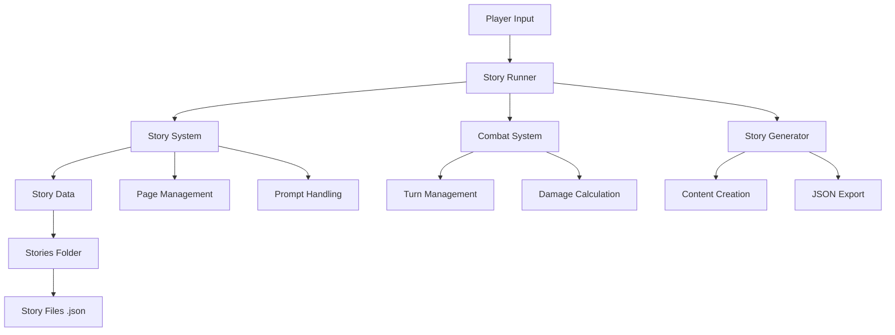
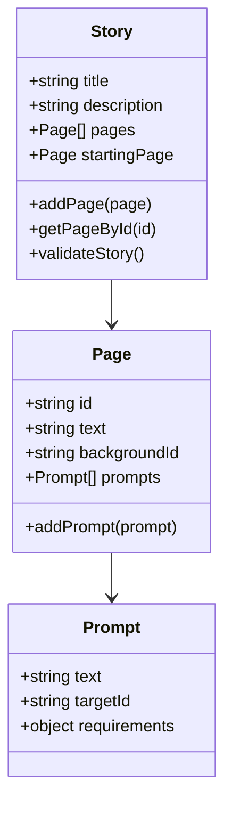
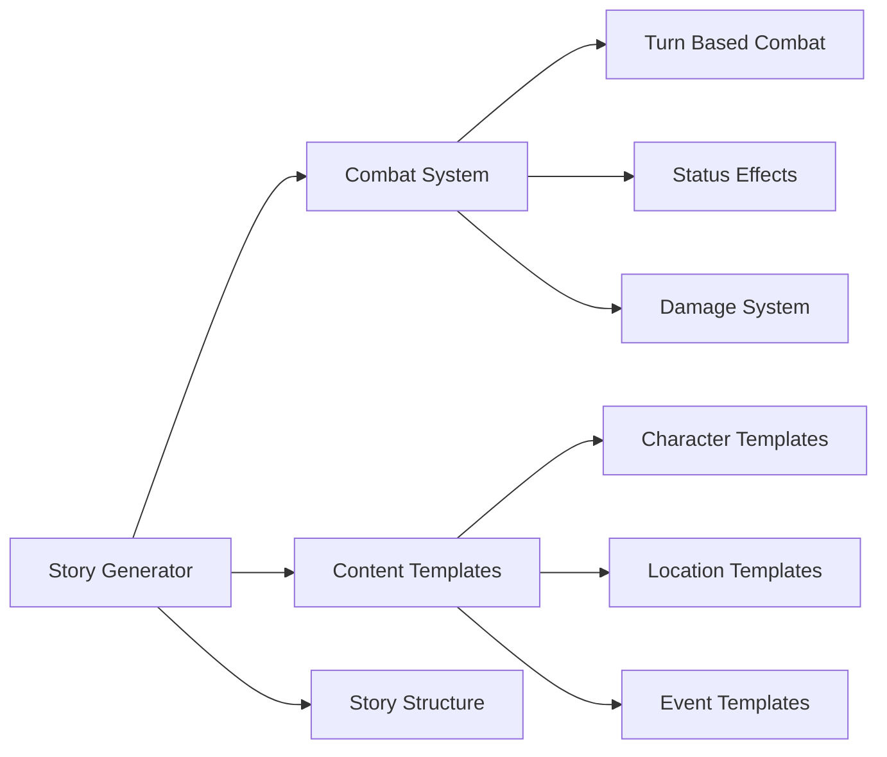
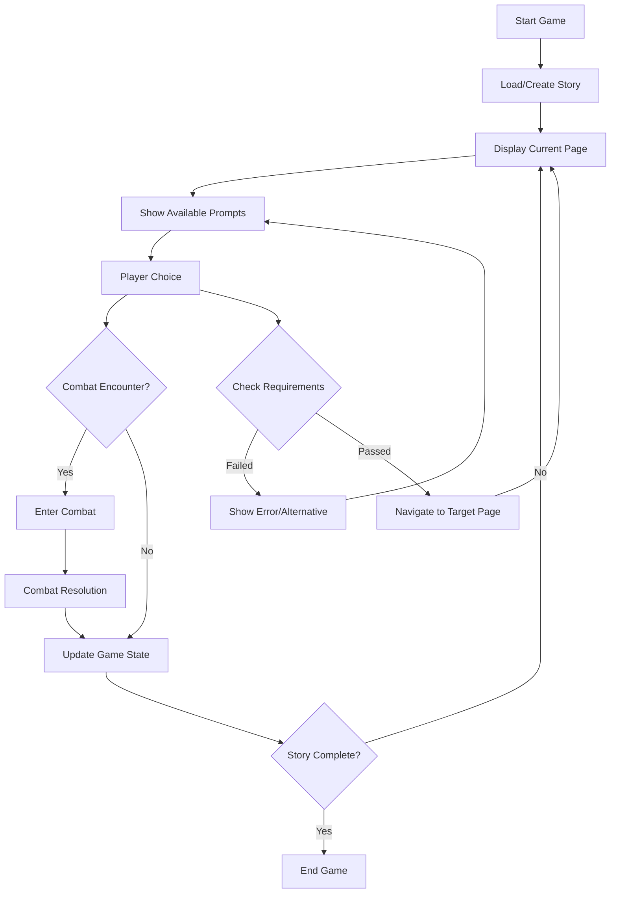
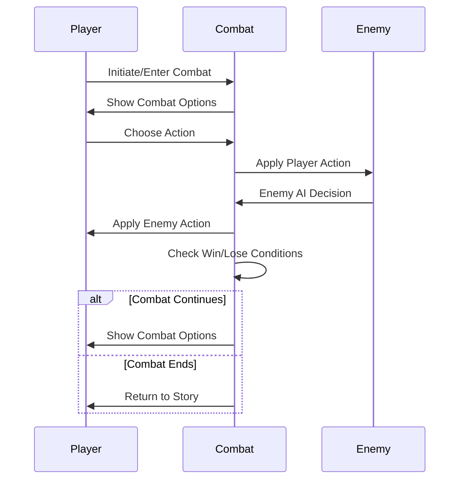
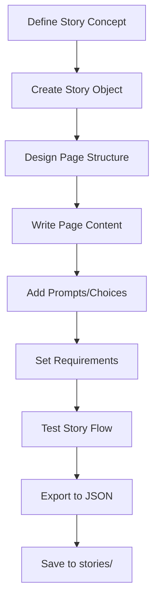

# The Dust Pilgrim - JavaScript Distributed Story System

A text-based narrative roguelike adventure game with inventory management and unique "Echo" life system. Players navigate a post-apocalyptic wasteland making critical decisions with limited resources.

## 🎮 Game Features

- **Narrative Roguelike**: Every playthrough reveals new story paths
- **16-slot Inventory System**: Tight resource management with strategic item choices
- **Echo Life System**: Learn from failures across multiple attempts
- **Branching Storylines**: Choices matter and shape your journey
- **Combat System**: Strategic turn-based encounters
- **Story Generation**: Dynamic content creation system

## 🏗️ Architecture Overview



## 📦 Core Components

### StorySystem.js
The foundation of the narrative engine containing:



### StoryGenerator.js
Handles dynamic story creation and combat mechanics:



## 🎯 Game Flow



## 🔧 File Structure

```
JavascriptDisibutedStory/
├── README.md                 # This file
├── DESIGN.md                # Game design document
├── TECHNICAL.md             # Technical specifications
├── StorySystem.js           # Core narrative engine
├── StoryGenerator.js        # Content generation & combat
├── run_story.js            # Main game runner with enhanced features
├── run.py                  # Python launcher script
├── start_story.bat         # Windows batch launcher
├── stories/                # Generated story files
│   ├── *.json             # Serialized story data
└── temp_*.js              # Development/testing scripts
```

## 🚀 Getting Started

### Prerequisites
- Node.js (any recent version)
- Terminal/Command Prompt access

### Running the Game

**Option 1: Direct Node.js**
```bash
node run_story.js
```

**Option 2: Python Launcher**
```bash
python run.py
```

**Option 3: Windows Batch File**
```cmd
start_story.bat
```

## 🎲 Game Mechanics

### Inventory System
- **16-slot limit** enforces strategic resource management
- Items can have multiple uses and requirements
- Inventory affects available story choices

### Echo Life System
- Players get **3 attempts** to complete their journey
- Knowledge from previous runs persists
- Failed attempts unlock new story paths
- Each "echo" changes the world state

### Combat System


## 🛠️ Development

### Story Creation Workflow



### Adding New Content

1. **Create new pages** using the `Page` class
2. **Define prompts** with appropriate requirements
3. **Test story branching** logic
4. **Export completed stories** to JSON format
5. **Store in stories/** directory

### Story Data Format

Stories are serialized as JSON with this structure:
```json
{
  "title": "Story Title",
  "description": "Story description",
  "pages": [
    {
      "id": "unique_page_id",
      "text": "Scene description",
      "background_id": "background_image_id",
      "prompts": [
        {
          "text": "Choice text",
          "target_id": "destination_page_id",
          "requirements": {
            "requiresItem": "item_name",
            "flagSet": "flag_name"
          }
        }
      ]
    }
  ]
}
```

## 🎨 Design Philosophy

- **Meaningful Choices**: Every decision should have weight and consequence
- **Resource Scarcity**: Limited inventory creates tension and strategy
- **Progressive Discovery**: Each playthrough reveals new aspects
- **Emergent Narrative**: Player choices drive unique story experiences
- **Accessible Complexity**: Deep systems with intuitive interfaces

## 🎨 Image Generation Tools

### Static Image Generation Options

**Commercial Cloud Services:**
- **Midjourney** - High-quality artistic images, subscription-based
- **DALL-E 3** (OpenAI) - Excellent for detailed prompts, API available
- **Stable Diffusion XL** - Open source, can run locally or cloud
- **Adobe Firefly** - Commercial use friendly, integrated with Adobe suite

**Free/Open Source:**
- **Stable Diffusion** - Free, runs locally, extensive community models
- **AUTOMATIC1111** - Popular SD web interface for local generation
- **ComfyUI** - Node-based SD interface for advanced workflows

### Dynamic Image Generation with Gemini

**Google Gemini Integration:**
- **Gemini Pro Vision** - Can analyze and describe existing images
- **Imagen 3** (via Vertex AI) - Google's image generation model
- **API Integration** - Use Google Cloud Vertex AI for programmatic access

**Local vs Cloud Implementation:**

**Cloud PC Benefits:**
- High-end GPU access (RTX 4090, A100)
- No local hardware investment
- Services like Vast.ai, RunPod, or Google Colab Pro
- Cost: $0.50-$2.00/hour for powerful instances

**Local Setup:**
- Requires RTX 3070+ (8GB+ VRAM recommended)
- One-time hardware cost but unlimited usage
- Full control over models and settings
- Privacy and offline capability

### Integration Ideas for Story System

```javascript
// Example image generation integration
class ImageGenerator {
  async generateSceneImage(pageText, backgroundId) {
    const prompt = `Fantasy post-apocalyptic scene: ${pageText}`;

    // Option 1: Local Stable Diffusion API
    return await this.callLocalSD(prompt);

    // Option 2: Cloud service
    return await this.callGeminiImagen(prompt);
  }
}
```

**Recommended Approach:**
1. Start with cloud services for prototyping
2. Consider local setup if generating many images
3. Use Gemini for dynamic prompt enhancement
4. Cache generated images to avoid regeneration costs

## 📝 Contributing

1. Fork the repository
2. Create a feature branch
3. Add your story content or system improvements
4. Test thoroughly with different story paths
5. Submit a pull request

## 📄 License

This project is open source. Feel free to use, modify, and distribute.

---

*"In the wasteland, every choice echoes through eternity. Choose wisely, Pilgrim."*